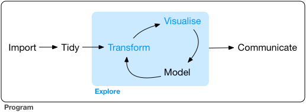

# Machine Learning

## Introduction

### Importing Data  
The first step in any machine learning project is importing your data into **R**.

### Tidying Data  
- Tidying your data means storing it in a consistent form that aligns with the semantics of the dataset and its storage.  
- **Why Tidy Data?**  
  - Consistent structure enables you to focus on answering questions about the data rather than reshaping it for different functions.

### Wrangling Data  
- **Transforming Data**: Calculating summary statistics such as counts or means.  
- **Wrangling**: The process of tidying and transforming data.  
  - It often feels like a "fight" to get your data into a usable form.  

---

## Engines of Knowledge Generation

### Visualisation  
- Visualisation is a **human activity**.  
- A good visualisation:  
  - Shows unexpected patterns or insights.  
  - Raises new questions or challenges assumptions.  
  - Can indicate that you're asking the wrong question or need different data.  
- **Limitation**: Visualisation doesn't scale well because it requires human interpretation.

### Modelling  
- Models are complementary to visualisations.  
- **Key Features**:  
  - Use precise questions to generate answers.  
  - Fundamentally mathematical or computational tools.  
  - Scale well—buying more computational power is cheaper than scaling human effort.  
- **Limitation**:  
  - Models make assumptions and cannot question those assumptions.  
  - They cannot fundamentally surprise you.

---

## Communication
- The **final step of data science** is communication.  
- No matter how well your models and visualisations work, they are ineffective unless you can communicate your results clearly to others.

---

## Data Exploration
- Data exploration is the **art of looking at your data**, rapidly generating hypotheses, testing them, and repeating the process.  
- This iterative approach helps uncover patterns, anomalies, or insights.

---

## Data Visualisation
- With data visualisation, you can create elegant and informative plots that enhance your understanding of the data.

---

## Resources

- **Cheatsheets**: [Posit Cheatsheets](https://posit.co/resources/cheatsheets/)  
- **Code Repository**: All scripts and RMarkdown files created in the videos are available on [GitHub](https://github.com/jyurko/Fall_2020_R_demos).  



--- 

# Machine Learning and Regression Overview

## Machine Learning Overview
The task of machine learning is to estimate the values of the parameters from the data by minimizing the observed error between the model's predictions and the true labels.

### Regression
Regression in machine learning refers to a supervised learning technique where the goal is to predict a continuous numerical value based on one or more independent features. It identifies relationships between variables to enable accurate predictions.

#### Common Performance Metrics
- **MSE (Mean Squared Errors)**: Measures the average squared difference between predicted and actual values.
- **RMSE (Root Mean Squared Error)**: The square root of MSE, providing a metric in the same units as the dependent variable.

---

## Tools and Techniques in R

### Forward Pipe Operator
The forward pipe operator (`%>%`) enables functional operations to be transformed into a left-to-right pipeline or workflow, making code more readable:
```r
<object> %>% <function>
```

### The `tibble` Package
The `tibble` package provides a modern approach to creating and manipulating data frames as part of the tidyverse. Advantages of `tibble`:
- User-friendly interface for data manipulation.
- Alternative to base R operations like `str()` is `glimpse()`.

### `dplyr` Package
`dplyr` is part of the tidyverse and provides core tools for data manipulation. It uses action verbs (e.g., `filter`, `select`, `mutate`) to make operations explicit and intuitive.

---

## Numerical Minimization with Newton-Raphson
The Newton-Raphson search method iteratively minimizes a function by:
1. Starting at an initial point.
2. Moving along the steepest slope.
3. Repeating until a minimum is found.

In R, this process can be implemented using the `optim()` function. This approach:
- Works for any model that can be written as an equation.
- Helps find the optimal model parameters.

Linear models (`lm()`) leverage a more efficient algorithm based on geometry, calculus, and linear algebra to find the global minimum in a single step. However, linear models can be sensitive to outliers due to the squared distance term.

---

## Residuals and Model Quality
- **Residuals**: Differences between observed and predicted values. They help identify what the model has missed.
- The average residual is always 0.
- A frequency polygon can visualize residual spread and assess model quality.

For categorical predictors, the model predicts the mean value for each category, as the mean minimizes the root-mean-squared distance. Use `model_matrix()` to inspect the fitted equation in linear models.

---

## Transformations in Regression
Transformations allow for approximation of non-linear functions. Taylor’s theorem states that any smooth function can be approximated by an infinite sum of polynomials. In R, you can use the `poly()` function for polynomial transformations:
```r
y = a_1 + a_2 * x + a_3 * x^2 + a_4 * x^3
```

---

## Data Visualization and Exploration

### Boxplots
A boxplot groups a continuous variable by a categorical variable, displaying summary statistics for each group. For more information, refer to the [Boxplot Guide](https://rpubs.com/Davo2812/1102821).

### EDA Questions
1. What type of variation occurs within my variables?
2. What type of covariation occurs between my variables?

- **Continuous Variables**: Variables that can take an infinite set of ordered values, such as numbers or date-times. Use histograms to examine their distribution.
- **Covariation**: Describes the relationship between variables. Use visualizations appropriate for the types of variables involved.

---

## Confidence Intervals in Regression
- Confidence intervals are horizontal lines extending from each coefficient in a plot.
- They represent the range within which the true coefficient value is likely to fall, typically with a 95% confidence level.
- If the confidence interval for a coefficient does not include 0, the variable is statistically significant.

---

## Linear Model Formula in R
The formula for linear regression in R is:
```r
y ~ x
```
- **`y`**: Dependent variable (response/outcome).
- **`x`**: Independent variable (predictor/explanatory variable).
```
